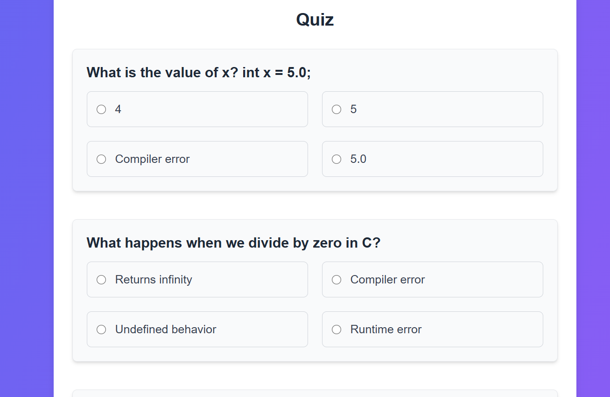

# Quiz_Learnify
This is a quiz application built with Next.js and Tailwind CSS.

## ✨ Features

- 🎯 Interactive Quiz System with Multiple-Choice Questions
- 🧠 Shuffled Questions and Options for each attempt
- 📊 Real-time Score Calculation
- 🔐 User Authentication via Email (using Local Storage)
- 💾 Score Submission to Backend and Saved by Email
- 📈 Paginated Questions (10 per page)
- 🖥️ Responsive UI using Tailwind CSS
- 🥳 Congratulations Page after Successful Submission


## 📸 Screenshots

### 🏠 Home Page


### ❓ Quiz Page


### 📝 Submission Page


## 🚀 Tech Stack

- Next.js
- TypeScript
- Tailwind CSS
- React Hooks
- Node.js (API)
- MongoDB 

---

## 📦 Setup & Installation

```bash
git clone https://github.com/HarshGaur123/Quiz_Learnify.git
cd learnify-quiz-main
npm install
npm run dev